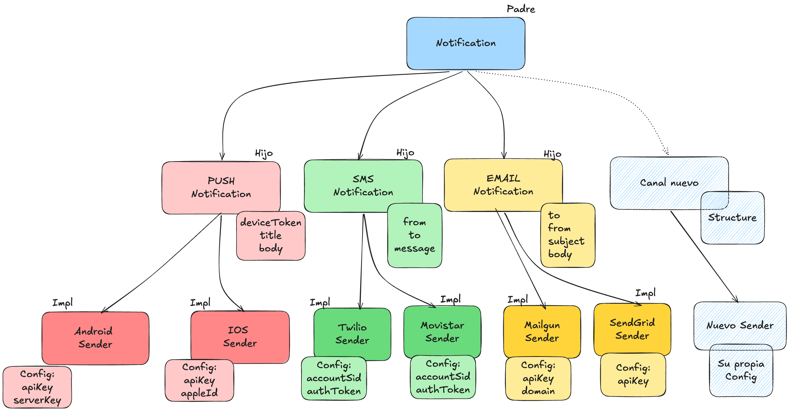

2. README.md
   Escribe un README pensando en otro desarrollador:
   Instalación
   Instalación: ¿Cómo se usa? (Maven/Gradle)
   Quick Start
   Quick Start: Un ejemplo simple
   Configuración
   Configuración: Cómo configurar cada canal y proveedor
   Proveedores soportados
   Proveedores soportados: Lista de integraciones
   API Reference
   API Reference: Clases y métodos principales
   Seguridad
   Seguridad: Mejores prácticas para manejar credenciales

Comandos que usarás
mvn clean → borra target/.
mvn compile → compila src/main.
mvn test → compila todo y corre los tests (el objetivo final del reto: mvn clean test en verde).
mvn package → genera el .jar en target/.
mvn dependency:tree → útil para ver qué dependencias arrastras.

Modelo
