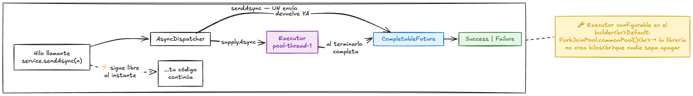
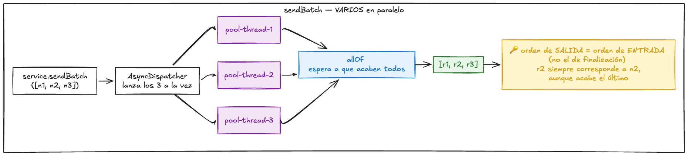
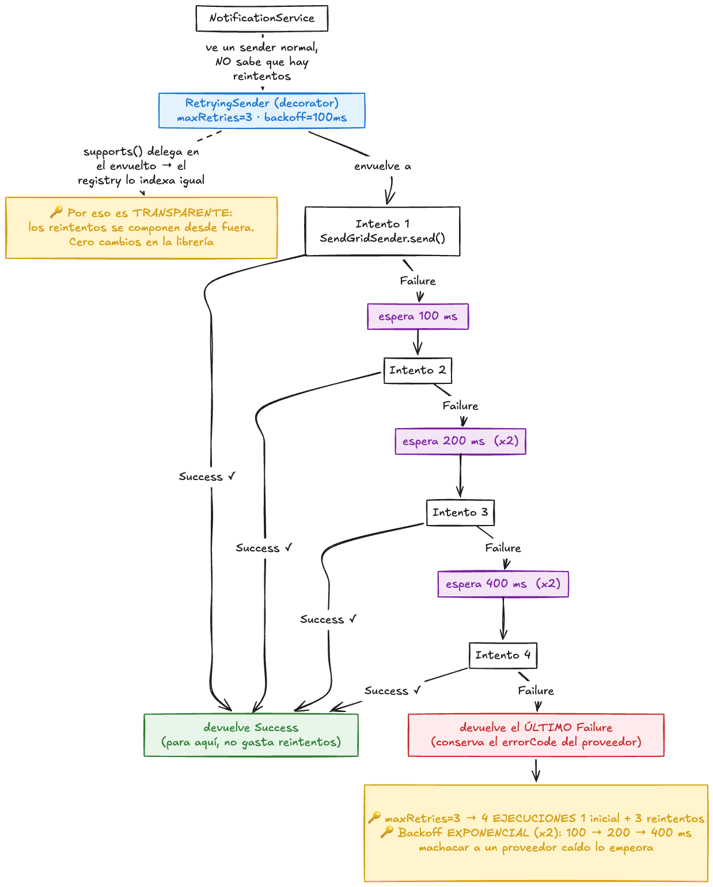
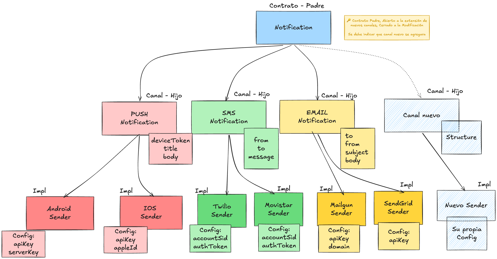
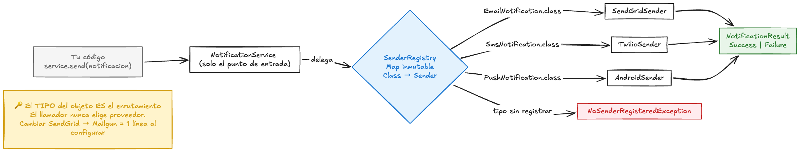

# notifications-package

Librería de notificaciones multicanal (**email, SMS y push**) para **Java 21**, agnóstica a
frameworks. Sin Spring, sin Quarkus, sin YAML ni properties: **toda la configuración se hace
por código**.

> El envío es **simulado**: los senders no hacen llamadas HTTP reales, pero registran vía
> SLF4J exactamente los datos que pediría cada proveedor.

**Índice**
- [Instalación](#instalación) · [Quick Start](#quick-start) · [Cómo se llama al servicio](#cómo-se-llama-al-servicio)
- [Configuración por canal](#configuración-por-canal-y-proveedor) · [Proveedores](#proveedores-soportados)
- [Asíncrono](#envío-asíncrono) · [Reintentos](#reintentos) · [Ejecutar los ejemplos](#ejecutar-los-ejemplos)
- [API Reference](#api-reference) · [Seguridad](#seguridad-de-credenciales) · [Cómo extender](#cómo-extender)
- [Decisiones de arquitectura](#decisiones-de-arquitectura) · [Uso de IA](#uso-de-ia) · [Qué faltaría](#qué-faltaría-por-hacer)

---

## Instalación

Requiere **Java 21** o superior.

**Maven**

```xml
<dependency>
    <groupId>com.notifications</groupId>
    <artifactId>notifications-lib</artifactId>
    <version>1.0.0</version>
</dependency>
```

**Gradle (Kotlin DSL)**

```kotlin
implementation("com.notifications:notifications-lib:1.0.0")
```

**Gradle (Groovy)**

```groovy
implementation 'com.notifications:notifications-lib:1.0.0'
```

La librería solo arrastra **`slf4j-api`**. No impone implementación de logging: elige tú la
tuya (Logback, Log4j2, `slf4j-simple`…). Lombok es `provided` y no se propaga.

**Instalar en tu repositorio local** (para probarla desde otro proyecto):

```bash
mvn clean install
```

---

## Quick Start

```java
// 1. Configura una vez, al arrancar la app
NotificationService service = NotificationService.builder()
        .register(new SendGridSender(new SendGridConfig(System.getenv("SENDGRID_API_KEY"))))
        .build();

// 2. Envía tantas veces como quieras
NotificationResult result = service.send(new EmailNotification(
        "cliente@ejemplo.com",      // to
        "no-reply@miapp.com",       // from
        "Bienvenido",               // subject
        "Gracias por registrarte"   // body
));

// 3. Trata el resultado
switch (result) {
    case Success s -> System.out.println("Enviado: " + s.messageId());
    case Failure f -> System.err.println("Fallo: " + f.errorCode());
}
```

---

## Cómo se llama al servicio

La librería tiene **un único punto de entrada**: `NotificationService`. El flujo es siempre
el mismo, en dos tiempos:

1. **Configurar** (una vez, al arrancar): eliges qué proveedor usa cada canal.
2. **Enviar** (N veces): pasas una notificación y el servicio ya sabe a quién dársela.

### 1. Construir el servicio

Registra **un sender por canal**. El proveedor concreto se decide aquí y en ningún otro sitio:

```java
NotificationService service = NotificationService.builder()
        // canal EMAIL -> proveedor SendGrid
        .register(new SendGridSender(
                new SendGridConfig(System.getenv("SENDGRID_API_KEY"))))

        // canal SMS -> proveedor Twilio
        .register(new TwilioSender(
                TwilioConfig.builder()
                        .accountSid(System.getenv("TWILIO_ACCOUNT_SID"))
                        .authToken(System.getenv("TWILIO_AUTH_TOKEN"))
                        .build()))

        // canal PUSH -> Android
        .register(new AndroidSender(
                AndroidConfig.builder()
                        .apiKey(System.getenv("FCM_API_KEY"))
                        .serverKey(System.getenv("FCM_SERVER_KEY"))
                        .build()))
        .build();
```

Para **cambiar de proveedor** solo cambias esa línea. El resto de tu código no se entera:

```java
.register(new MailgunSender(mailgunConfig))   // en vez de SendGridSender
```

> ⚠️ **Un solo sender por canal.** Si registras SendGrid *y* Mailgun a la vez, `build()`
> lanza `IllegalStateException`: ambos atienden `EmailNotification` y enviar por los dos
> significaría mandar el mismo email dos veces. El error salta al configurar, no en
> producción.

### 2. Enviar

Creas la notificación y llamas a `send()`. **No eliges el canal**: lo determina el tipo.

```java
// EMAIL
service.send(new EmailNotification(
        "cliente@ejemplo.com", "no-reply@miapp.com", "Bienvenido", "Gracias por registrarte"));

// SMS  (teléfonos en formato E.164)
service.send(new SmsNotification(
        "+56911111111", "+56922222222", "Tu código es 1234"));

// PUSH
service.send(new PushNotification(
        "device-token-abc123", "Pedido enviado", "Tu pedido va en camino"));
```

### 3. Leer el resultado

`send()` devuelve un `NotificationResult`, que solo puede ser `Success` o `Failure`.
Al ser un tipo sellado, el compilador te obliga a tratar ambos casos (no necesitas `default`):

```java
NotificationResult result = service.send(notification);

switch (result) {
    case Success s -> log.info("Enviado, id={} a las {}", s.messageId(), s.timestamp());
    case Failure f -> log.error("Fallo [{}]: {}", f.errorCode(), f.message());
}
```

### Errores: excepción vs. Failure

Es la regla más importante de la API:

| Situación | Qué obtienes | Cuándo |
|---|---|---|
| Datos inválidos (email mal formado, campo vacío) | `InvalidNotificationException` | **Al construir** la notificación |
| No registraste sender para ese canal | `NoSenderRegisteredException` | Al llamar a `send()` |
| El proveedor rechaza / falla la red | `Failure` (**no** excepción) | Dentro del resultado |

En corto: **los errores de programación lanzan; los fallos de envío se devuelven**.

```java
try {
    var email = new EmailNotification("esto-no-es-un-email", "a@b.com", "Hola", "Texto");
} catch (InvalidNotificationException e) {
    // salta aquí, ANTES de intentar enviar nada
}
```

---

## Configuración por canal y proveedor

Cada proveedor tiene su config **inmutable**, que se le pasa por constructor. Regla de oro:

> **La notificación lleva lo que cambia por mensaje** (destinatario, contenido).
> **La config lleva lo que es fijo por cuenta** (credenciales, dominio, servidor).

### Email

```java
// SendGrid
new SendGridSender(new SendGridConfig(System.getenv("SENDGRID_API_KEY")));

// Mailgun — el 'domain' es propio de Mailgun y va en SU config, no en la notificación
new MailgunSender(MailGunConfig.builder()
        .apiKey(System.getenv("MAILGUN_API_KEY"))
        .domain("mg.miapp.com")
        .build());
```

### SMS

```java
// Twilio
new TwilioSender(TwilioConfig.builder()
        .accountSid(System.getenv("TWILIO_ACCOUNT_SID"))
        .authToken(System.getenv("TWILIO_AUTH_TOKEN"))
        .build());

// Vonage
new VonageSender(VonageConfig.builder()
        .accountSid(System.getenv("VONAGE_ACCOUNT_SID"))
        .authToken(System.getenv("VONAGE_AUTH_TOKEN"))
        .build());

// Movistar
new MovistarSender(MovistarConfig.builder()
        .accountSid(System.getenv("MOVISTAR_ACCOUNT_SID"))
        .authToken(System.getenv("MOVISTAR_AUTH_TOKEN"))
        .build());
```

### Push

```java
// Android
new AndroidSender(AndroidConfig.builder()
        .apiKey(System.getenv("FCM_API_KEY"))
        .serverKey(System.getenv("FCM_SERVER_KEY"))
        .build());

// iOS
new IOSSender(IOSConfig.builder()
        .apiKey(System.getenv("APNS_API_KEY"))
        .appleId(System.getenv("APPLE_ID"))
        .build());
```

---

## Proveedores soportados

| Canal | Notificación | Proveedor | Config | Campos |
|---|---|---|---|---|
| **Email** | `EmailNotification` | `SendGridSender` | `SendGridConfig` | `apiKey` |
| | | `MailgunSender` | `MailGunConfig` | `apiKey`, `domain` |
| **SMS** | `SmsNotification` | `TwilioSender` | `TwilioConfig` | `accountSid`, `authToken` |
| | | `VonageSender` | `VonageConfig` | `accountSid`, `authToken` |
| | | `MovistarSender` | `MovistarConfig` | `accountSid`, `authToken` |
| **Push** | `PushNotification` | `AndroidSender` | `AndroidConfig` | `apiKey`, `serverKey` |
| | | `IOSSender` | `IOSConfig` | `apiKey`, `appleId` |

Recuerda: **son alternativas, no acumulables**. Registra uno por canal.

---

## Envío asíncrono


Además de `send()`, el servicio ofrece envío sin bloquear y por lotes, con `CompletableFuture`.

### `sendAsync` — un envío, sin bloquear



```java
CompletableFuture<NotificationResult> futuro = service.sendAsync(notification);

// tu hilo sigue libre...
futuro.thenAccept(result -> {
    switch (result) {
        case Success s -> log.info("Enviado: {}", s.messageId());
        case Failure f -> log.error("Fallo: {}", f.errorCode());
    }
});
```

### `sendBatch` — varios envíos en paralelo



Admite **canales mezclados** en el mismo lote:

```java
List<Notification> lote = List.of(
        new EmailNotification("a@b.com", "no-reply@miapp.com", "Hola", "Cuerpo"),
        new SmsNotification("+56911111111", "+56922222222", "Tu código"),
        new PushNotification("token-123", "Título", "Cuerpo"));

List<NotificationResult> resultados = service.sendBatch(lote).join();
```

**Los resultados conservan el orden de la lista de entrada**, no el de finalización, para
que puedas correlacionar cada resultado con la notificación que lo originó.

### Executor configurable

Por defecto se usa `ForkJoinPool.commonPool()`, para que **la librería no cree hilos propios
ni te obligue a apagarlos**. Si tu app tiene su pool, pásalo:

```java
ExecutorService pool = Executors.newFixedThreadPool(10);

NotificationService service = NotificationService.builder()
        .register(new SendGridSender(config))
        .executor(pool)          // el pool es tuyo: tú lo creas y tú lo apagas
        .build();
```

> 💡 Como los envíos son de **E/S** (esperan a la red), un pool dedicado suele ser mejor idea
> que el común, que está pensado para trabajo de CPU.

### Comportamiento ante errores

| Caso | Qué pasa con el futuro |
|---|---|
| Envío falla (`Failure`) | Se completa **normalmente**, con un `Failure`. La regla "fallo de envío = valor" también aplica en asíncrono |
| Canal sin sender registrado | Se completa **excepcionalmente** con `NoSenderRegisteredException` |
| En `sendBatch`, un canal sin sender | El lote entero se completa excepcionalmente: un error de configuración debe verse, no perderse entre los resultados correctos |

---

## Reintentos



`RetryingSender` es un **decorator**: envuelve cualquier sender y reintenta ante `Failure`,
con **backoff exponencial**. No se "activa" en ningún sitio de la librería — **se compone al
registrar**:

```java
NotificationService service = NotificationService.builder()
        .register(new RetryingSender<>(
                new SendGridSender(sendGridConfig),   // sender envuelto
                3,                                    // maxRetries
                Duration.ofMillis(100)))              // backoff inicial
        .build();
```

- **`maxRetries = 3`** → hasta **4 ejecuciones**: 1 inicial + 3 reintentos.
- **`maxRetries = 0`** → 1 sola ejecución (retry desactivado).
- **Backoff exponencial**: con 100 ms → espera 100, 200, 400 ms.
- Si algún intento va bien, **para ahí**. Si se agotan, devuelve **el último `Failure`**,
  conservando el `errorCode` del proveedor.

Puedes decidir la política **canal por canal**:

```java
NotificationService.builder()
        // email CON reintentos
        .register(new RetryingSender<>(new SendGridSender(sg), 3, Duration.ofMillis(100)))
        // SMS SIN reintentos (cada intento cuesta dinero)
        .register(new TwilioSender(tw))
        .build();
```

Y como cada decorator **es** un `NotificationSender`, se pueden apilar.

---

## Ejecutar los ejemplos

`NotificationExamples` es una demo ejecutable que recorre los 3 canales, el async, los
reintentos, la frontera excepción/`Failure` y el enmascarado de credenciales.

### Opción 1 — Docker (no necesitas Java instalado)

```bash
docker build -t notifications-lib .
docker run --rm notifications-lib
```

### Opción 2 — Local con Maven

```bash
# compila la librería y baja sus dependencias de runtime
./mvnw clean package -DskipTests dependency:copy-dependencies -DincludeScope=runtime

# ejecuta la demo
java -cp "target/notifications-lib-1.0.0.jar:target/dependency/*" \
     com.notifications.examples.NotificationExamples
```

### Opción 3 — Desde el IDE

Abre `src/main/java/com/notifications/examples/NotificationExamples.java` y ejecuta su `main`.

### Qué vas a ver

```
1. CANAL EMAIL (SendGrid)
[main] INFO ...SendGridSender - [SendGrid] POST /v1/email/send apiKey=**** from=... to=...
  ✓ Success  id=transactionId_1d12d77f...

4. ASÍNCRONO (CompletableFuture)
[pool-1-thread-2] INFO ...SendGridSender - ...      ← hilos distintos = paralelismo real
[pool-1-thread-3] INFO ...TwilioSender - ...

5. REINTENTOS (RetryingSender)
  [proveedor inestable] intento 1 -> 503 Service Unavailable
[main] WARN ...RetryingSender - Envío fallido; reintento 1 de 3 en 100 ms
  [proveedor inestable] intento 2 -> 503 Service Unavailable
[main] WARN ...RetryingSender - Envío fallido; reintento 2 de 3 en 200 ms   ← backoff x2
  [proveedor inestable] intento 3 -> 200 OK
```

Fíjate en `apiKey=****` (enmascarado), en los distintos `pool-1-thread-N` (paralelismo) y
en `100 ms → 200 ms` (backoff exponencial).

**Credenciales**: la demo lee variables de entorno y, si no existen, usa valores de relleno
para poder correr sin configurar nada. Para verla con las tuyas:

```bash
docker run --rm -e SENDGRID_API_KEY=xxx -e TWILIO_ACCOUNT_SID=yyy notifications-lib
```

### Ejecutar los tests

```bash
./mvnw clean test
```

---

## API Reference

### `NotificationService` — la fachada

| Método | Devuelve | Descripción |
|---|---|---|
| `builder()` | `Builder` | Punto de entrada para configurar |
| `send(Notification)` | `NotificationResult` | Envío síncrono, despachado por tipo |
| `sendAsync(Notification)` | `CompletableFuture<NotificationResult>` | Envío sin bloquear |
| `sendBatch(List<? extends Notification>)` | `CompletableFuture<List<NotificationResult>>` | Envíos en paralelo, resultados en orden de entrada |

### `NotificationService.Builder`

| Método | Descripción |
|---|---|
| `register(NotificationSender<?>)` | Registra un sender. Uno por tipo; dos del mismo canal → `IllegalStateException` en `build()` |
| `executor(Executor)` | Pool para async. Default: `ForkJoinPool.commonPool()` |
| `build()` | Crea el servicio, ya inmutable y seguro entre hilos |

### `Notification` — sealed

| Tipo | Componentes | Validación |
|---|---|---|
| `EmailNotification` | `to`, `from`, `subject`, `body` | `to`/`from` con formato email; resto no vacíos |
| `SmsNotification` | `from`, `to`, `message` | `from`/`to` en E.164; `message` no vacío |
| `PushNotification` | `deviceToken`, `title`, `body` | Ninguno vacío |

Todas son `record` inmutables y validan en el **constructor compacto**: si se construyen,
son válidas.

### `NotificationResult` — sealed

| Tipo | Componentes | Notas |
|---|---|---|
| `Success` | `messageId`, `timestamp` | `Success.of(id)` pone el timestamp automáticamente |
| `Failure` | `errorCode`, `message`, `cause` | `cause` es opcional; hay constructor de 2 args |

### `NotificationSender<T extends Notification>` — el contrato (Strategy)

| Método | Descripción |
|---|---|
| `send(T)` | Envía. Un fallo devuelve `Failure`, **no lanza** |
| `supports()` | `Class<T>` del tipo que atiende. Es la clave del despacho |

### `RetryingSender<T>` — decorator

`new RetryingSender<>(delegate, maxRetries, initialBackoff)`

### Excepciones

```
NotificationException (RuntimeException)
├── InvalidNotificationException     datos inválidos, al construir
└── NoSenderRegisteredException      canal sin sender, al enviar
```

---

## Seguridad de credenciales

- **Nunca hardcodees credenciales.** Léelas de variables de entorno:
  ```java
  new SendGridConfig(System.getenv("SENDGRID_API_KEY"))
  ```
- **El `toString()` de todas las configs enmascara los secretos.** Esto no es gratis: el
  `toString()` que genera un `record` por defecto **imprimiría la API key en claro**, así que
  está sobrescrito en todas:
  ```java
  System.out.println(config);   // SendGridConfig{apiKey=****}
  ```
- **Los senders también enmascaran al loggear** la petición simulada.
- El enmascarado **no revela ni la longitud**: un secreto de 3 y otro de 40 caracteres dan
  la misma salida (`****`).
- Los datos **no sensibles** (dominio, número emisor, región) **sí** se muestran: ayudan a
  depurar y no son secretos.
- Nunca subas credenciales al repositorio; usa variables de entorno o un gestor de secretos.

---

## Cómo extender

¿Necesitas un proveedor o un canal que no está? Está documentado paso a paso, con un caso
real trabajado de punta a punta, en **[knowHowExtending.md](knowHowExtending.md)**:

- **Añadir un proveedor** a un canal existente (ej. Amazon SES) → no se toca ni un archivo existente
- **Añadir un canal nuevo** entero (ej. WhatsApp) → solo se toca el `permits` de `Notification`

Incluye checklist y los errores típicos que conviene evitar.

---

## Decisiones de arquitectura

### `sealed` + `records` para el modelo



El criterio: **¿el conjunto de variantes es cerrado y propiedad mía, o abierto a terceros?**

- **Los tipos de notificación son un conjunto cerrado**: yo defino qué clases de
  notificación existen. → `sealed`.
- **Los proveedores son un conjunto abierto**: cualquiera debería poder añadir uno sin tocar
  mi código. → interfaz normal.

O sea: **sello los datos, dejo abierto el comportamiento.**

Sellar el modelo da **exhaustividad verificada por el compilador**: un `switch` sobre
`Notification` o `NotificationResult` no necesita `default`, y si mañana aparece un tipo
nuevo, **todos los switches dejan de compilar** hasta tratarlo. Con una interfaz abierta eso
es imposible: haría falta un `default` que se traga los casos nuevos en silencio.

`record` aporta inmutabilidad, `equals`/`hashCode` y semántica de valor gratis, y su
**constructor compacto** es el sitio canónico de la validación. Consecuencia: **una
notificación construida es siempre válida**; no hay estados ilegales representables.

*Descartadas*: un `enum` (todas las constantes comparten forma, y aquí cada canal tiene
campos distintos); una jerarquía abierta (se pierde la exhaustividad); una clase única con
campo `type` y campos anulables (permitiría un email con teléfono y sin asunto).

### Strategy para los proveedores



`NotificationSender<T>` con `send(T)` y `supports()`. La clave es que `supports()` devuelve
`Class<T>`: el servicio indexa los senders en un `Map<Class<?>, NotificationSender<?>>` y
despacha con `notification.getClass()`.

**El tipo del objeto es el enrutamiento.** Añadir un canal = crear un sender que devuelve su
propia clase. **No hay un `enum` central de canales que mantener** → Open/Closed real.

Deliberadamente **no** se usa un `switch` exhaustivo en el servicio, aunque `Notification`
sea sellada: ese switch acoplaría el servicio a los canales y rompería el Open/Closed. El
sellado da exhaustividad a **quien consuma**; el despacho se queda abierto.

### Builder para el servicio y las configs

- **Del servicio**: acumula senders y en `build()` los congela en un mapa inmutable
  (`Map.copyOf`). El resultado es **inmutable y seguro entre hilos sin sincronizar**, que es
  justo lo que necesita el envío asíncrono. Además detecta duplicados **al configurar**
  (fail-fast) en vez de en producción.
- **De las configs**: legibilidad con varios campos y garantía de inmutabilidad. Se usa
  Lombok `@Builder`, pero **el `toString()` enmascarado es manual**: Lombok no cubre ese
  requisito de seguridad.

### Errores: excepción vs. valor

- **Errores de programación** (dato inválido, sender sin registrar) → **excepción**. Que
  salte fuerte y temprano.
- **Fallos de envío** (proveedor caído, red) → **`Failure` como valor**. Son condiciones
  operativas esperables, no bugs.

Un valor no se puede ignorar por accidente, compone bien en `sendBatch`, y permite que
`RetryingSender` reintente con un simple `if (result instanceof Success)`. Si los fallos
fueran excepciones, el retry y el batch serían un nido de `try/catch`.

### Decorator para los reintentos

`RetryingSender` implementa el mismo contrato que envuelve y **delega `supports()`**, así que
es transparente: el servicio no sabe que existe. Por eso los reintentos **se componen desde
fuera** y no hay ni un `if (retryEnabled)` dentro de la librería. Permite políticas distintas
por canal y apilar decorators.

### Separación `NotificationService` / `SenderRegistry`

El servicio es **solo el punto de entrada**: no sabe de `Map`, ni de `supports()`, ni de
canales. La resolución vive en `SenderRegistry`. Si mañana cambia la estrategia de resolución
(por prioridad, por feature flag), se toca el registry y el servicio ni se entera.

El `@SuppressWarnings("unchecked")` del registry es inevitable (el mapa es heterogéneo y los
genéricos se borran en runtime) pero **seguro por construcción**: la clave siempre sale de
`sender.supports()`, así que la invariante `Class<T> → NotificationSender<T>` no se puede
romper desde fuera. El cast está **confinado** junto al envío para que ese tipo no se filtre
a la API.

### Desviaciones conscientes del enunciado

Estas decisiones se apartan de la letra del enunciado. Las declaro explícitamente:

| Desviación | Motivo |
|---|---|
| **`AndroidSender`/`IOSSender`** en vez de `FcmSender`/`OneSignalSender` | Decisión propia: modelar los destinos por plataforma en lugar de por servicio agregador. **Contrapartida conocida**: ambos declaran `PushNotification.class`, así que solo puede registrarse uno a la vez; con FCM/OneSignal la elección sería de proveedor y no de plataforma. Se asume el coste. |
| **`MovistarSender`** añadido | `VonageSender` está implementado como pide el enunciado. Movistar se suma como **marca propia**, para demostrar que añadir un proveedor no requiere tocar código existente. |
| **`Success`/`Failure` en `model`** en vez de un paquete `result` | Conviven con `Notification` por cercanía conceptual: son el modelo de dominio. Se prefirió menos fragmentación de paquetes. |
| **`config` con subpaquetes** (`config.email`, `config.sms`, `config.push`) | Espeja la estructura de `channel.*` y evita un paquete plano con 7 configs mezcladas. |

---

## Uso de IA

Este proyecto se desarrolló usando IA como **copiloto**, de forma explícita y documentada.

**Yo diseñé la solución** y la fui **iterando** hasta cumplir con el plazo establecido. La IA
no sustituyó las decisiones de arquitectura: cada decisión de este documento se tomó, se discutió y se validó antes de escribir código.

**Dónde me apoyé concretamente:**

- **Documentación** — redacción del README, del Javadoc de las interfaces públicas y de la
  guía de extensión.
- **Creación de tests y casos borde** — la batería de pruebas y, sobre todo, la exploración
  sistemática de casos límite: los bordes de E.164 (2 y 15 dígitos), la interrupción de hilos
  durante el backoff, el orden de resultados en `sendBatch`, el enmascarado que no filtra ni
  la longitud del secreto.
- **Búsqueda de algoritmos** — por ejemplo las expresiones regulares de validación de email
  y de teléfono en formato E.164.

**Cómo se usó**: como interlocutor para contrastar decisiones y como acelerador en las partes
mecánicas (documentación y pruebas), revisando y ajustando todo lo generado. El resultado es
código que entiendo y puedo defender línea por línea.

Gracias al uso de la IA pude cumplir con el reto dentro del tiempo determinado,
caso contrario hubiera necesitado mas tiempo para hacerlo.

---

## Qué faltaría por hacer

Con más tiempo, por orden de valor:

**Funcionalidad**
- **Distinguir fallos reintentables de los que no lo son.** Hoy `RetryingSender` reintenta
  ante cualquier `Failure`, pero un "destinatario inválido" (400) fallará idéntico las 4
  veces: reintentarlo es tiempo perdido. Se resolvería con un `Predicate<Failure>`
  configurable, reintentando solo lo transitorio (timeout, 503).
- **`FallbackSender`**: decorator que ante un `Failure` del proveedor primario prueba con el
  secundario (SendGrid → Mailgun). Encaja sin tocar nada, igual que el retry.
- **Circuit breaker**: dejar de golpear a un proveedor que lleva N fallos seguidos.
- **`sendBatch` con resultados parciales**: hoy, si una notificación del lote no tiene sender,
  el futuro entero se completa excepcionalmente y se pierden los resultados de las que sí
  salieron. Devolver un resultado por notificación permitiría reportar cada una por separado.
- **Rate limiting** por proveedor y **plantillas** de mensaje.

**Calidad**
- **La rama `Failure` de los senders reales es inalcanzable**: su `try/catch` captura
  `RuntimeException`, pero dentro solo hay un `log.info` que nunca lanza. Con envío simulado
  no hay forma realista de cubrirla; el flujo de `Failure` se prueba con mocks a nivel de
  servicio. Con HTTP real dejaría de ser código muerto.
- **`Objects.requireNonNull(config)` en todos los senders**: hoy solo `SendGridSender` lo
  hace; el resto acepta un config nulo y falla más tarde con un NPE confuso.
- **Tests de integración** contra los sandbox reales de los proveedores.
- **Cobertura medida** (JaCoCo) y análisis estático (SpotBugs, Checkstyle) en CI.

**Producción**
- **Envío HTTP real** sustituyendo los logs simulados, con timeouts y pooling de conexiones.
- **Métricas y trazas**: contadores de envíos, latencia por proveedor, tasa de reintentos
  (Micrometer / OpenTelemetry).
- **Idempotencia**: clave por notificación para evitar duplicados si el cliente reintenta.
- **Publicación** del artefacto en un repositorio (Maven Central / Nexus).
